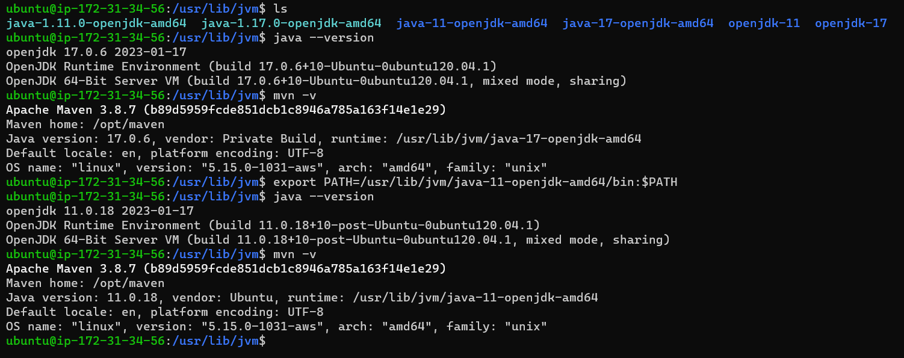
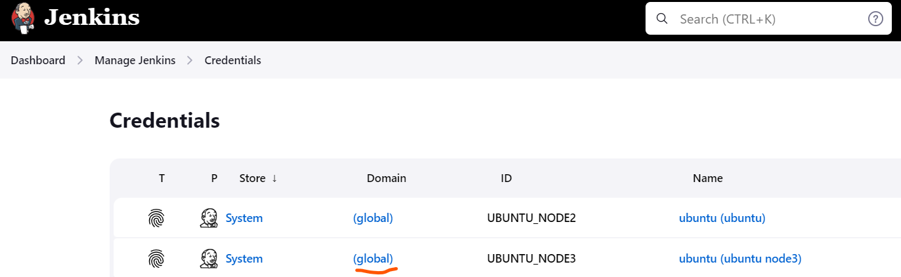
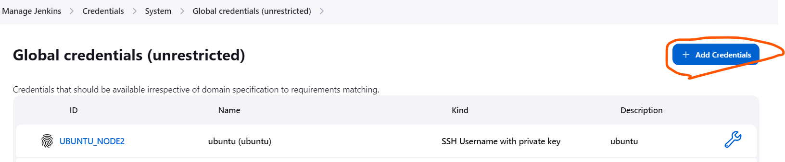
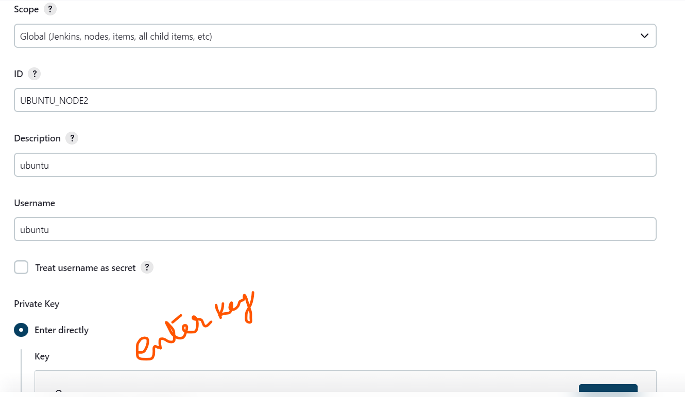
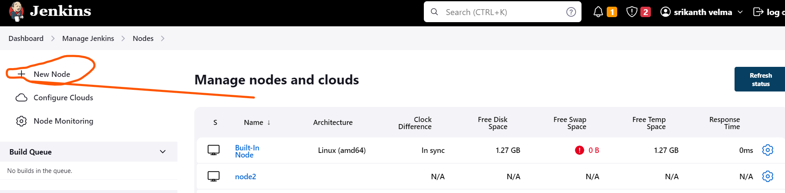
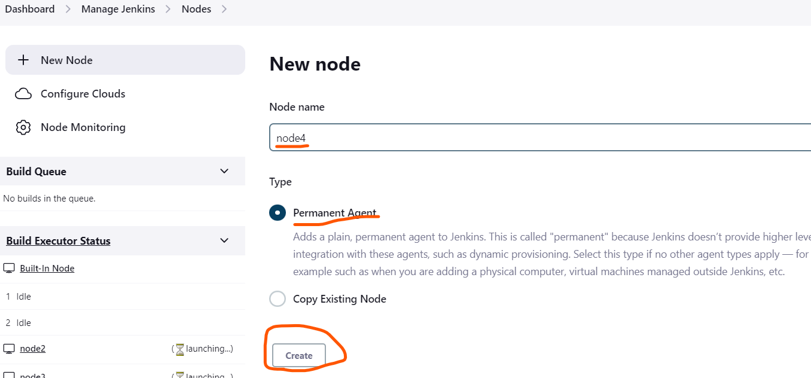
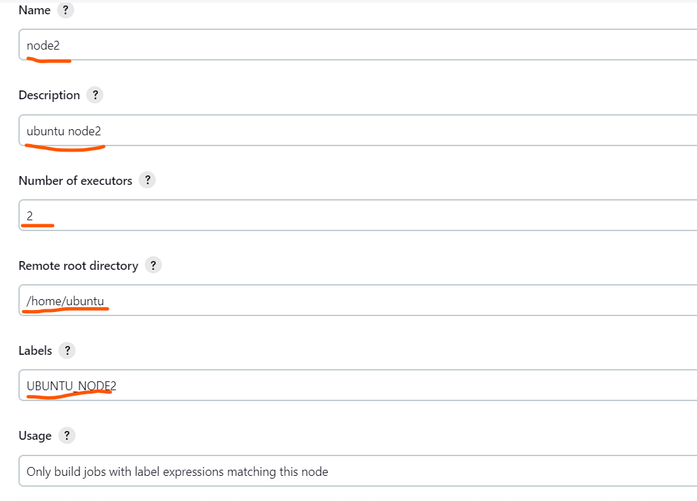
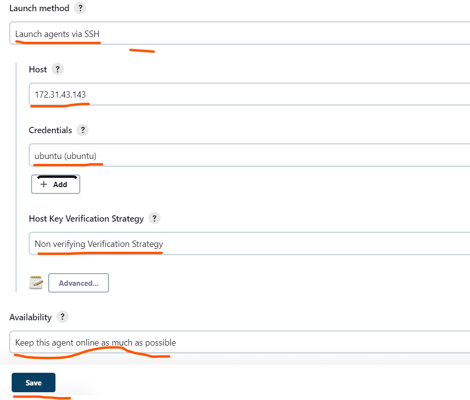

Jenkins Pipeline for Spring Petclinic
-------------------------------------
* Pre-requisites
1. Jenkins node 
    * Java - 11 or above
    * jenkins 
    * Ubuntu - 20.04 & t2.micro /t2.medium
*  Jenkins installation on master node

* Long Term Support release
```
curl -fsSL https://pkg.jenkins.io/debian-stable/jenkins.io.key | sudo tee \
/usr/share/keyrings/jenkins-keyring.asc > /dev/null

echo deb [signed-by=/usr/share/keyrings/jenkins-keyring.asc] \
https://pkg.jenkins.io/debian-stable binary/ | sudo tee \ 
/etc/apt/sources.list.d/jenkins.list > /dev/null

sudo apt-get update
sudo apt-get install jenkins -y
```

2. For Nodes
    * Java - 17
    * maven - 3.8 or above ( with Java 17)
    * note : here if we have already installed other java version  ( EX:java 11 or java 8..etc), here we should export the path of java ..we have to play with environmental PATH variable to set req Java version for maven.
    

Config Jenkins node and nodes
------------------------------
* config Jenkins and logon to jenkins page by user and password ,which is set when we configure -<publicip:8080> 
* to config node to jenkins we require to save private key (pem key) as **credentials**
* **Dashboard => Manage jenkins => manage Credentials**



* **Dashboard => Manage jenkins => Manage nodes**





* **Declarative Pipeline**
* General Declarative Pipeline syntax
  ```js
  pipeline{
    agent{ label 'UBUNTU_NODE' }
    environment{}
    options{}
    triggers{ pollSCM('* * * * *')}
    parameters{}
    tools{ JDK 'JDK_8' }
    libraries{}
    post{}
    stages{
        stage('vcs'){
            agent{}
            environment{}
            tools{}
            post{}
            steps{
                // DSL - Domain specific language

            }
        }
    }  
  }
  ```

  }
  ```
* **Day Build Requirements**
* these builds represent builds during the active run time and which will take less time (apprx 20 mins).
* for this we have pipelines ,which will give feedback to developers on their commited code quality.
* these builds will have
    * Build 
    * package
    * unit test
    * static code analysis
  

```js
pipeline{
    agent{ label ('<nodelabel>')}
    triggers{ pollSCM ('* * * * *')}
    stages{
        stage('vcs stage'){
            steps{
                // git steps / credentials
            }
        }
        stage('build'){
            steps{
                // build steps / commands to build
            }
        }
        stage('sonar analysis'){
            steps{
                // sonar analysis steps
            }
        }
        stage('post build'){
            steps{
                //archive artifacts and publish junit test results
            }
        }
        stage('copy/push build'){
            steps{
                // copy the build to s3 bucket or any storage repo or artifactory
            }
        }
    }
    post{
        success{
            mail // sent a mail req people
        }
        failure{
            mail //sent a failure details to req people or team
        }
    }
}
```

* **Night Builds Requirements**
* these builds represents the work of the team for the entire day
* these builds will have
    * build
    * package
    * unit tests
    * static code analysis
    * store the package into binary repo
    * creating/update test environments with latest packages and executing automated tests
    * generate reports for QA and mgmt
  